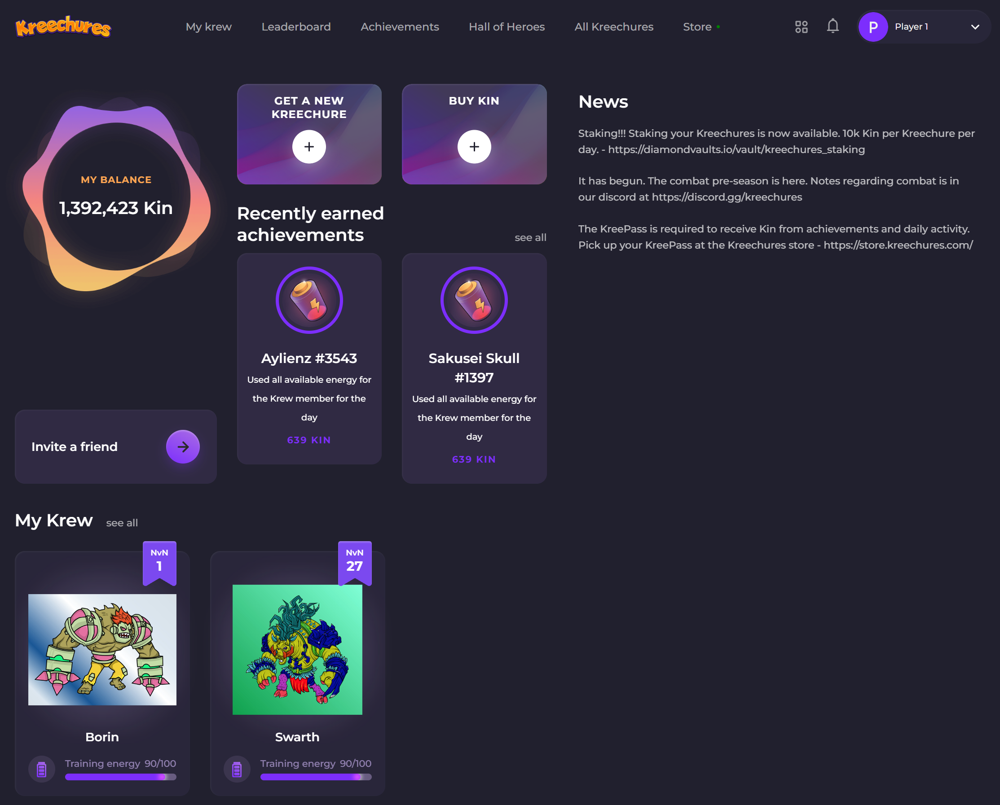

# RPG

At first glance, it could seem odd to the Solana NFT ecosystem to release a game in this genre, [online text-based RPG](https://en.wikipedia.org/wiki/Online\_text-based\_role-playing\_game). It's pretty reasonable to learn about the genre and wonder what the hell is Kreechures doing.


What are you doing?


**Facts:**

* Kreechures, the game, is targeting gamers, not NFT enthusiasts, that play this genre of game
* The longtail here is large enough to kickstart the value creation we are targeting for our collection. There are more daily players of this genre of game than active daily wallets on Magic Eden ([stats](https://magiceden.io/stats/marketplaces))
* As the first collection on Solana, releasing our first game, it was absolutely critical to target a genre that has enough players for our needs while at the same time allowing us to actually deliver. Every other project released has a "game" on their roadmap. How many actually exist?
* Kreechures, the game, is open to ALL Solana NFTs that are tracked by Magic Eden
* Kreechures is a free to play game with P2E components for players that have purchased the KreePass, purchased with Kin
* On any random day, there are > 3000 Krew, individual NFTs, that players use to train and/or use in combat in-game
* Kreechures has more than 11k registered players that have more than 373K individual Krew (NFTs) in their wallets
* More than 12k battles have occurred since beginning our first pre-season of combat

Early this year, 2022, we moved to a new UI, designed by an actual/professional designer!, and are constantly working to increase the depth of the game.

**Additional information:**

* [Game](https://beta.kreechures.com/login)
* [Other text/browser based RPGs](https://newrpg.com/categories/all/)
