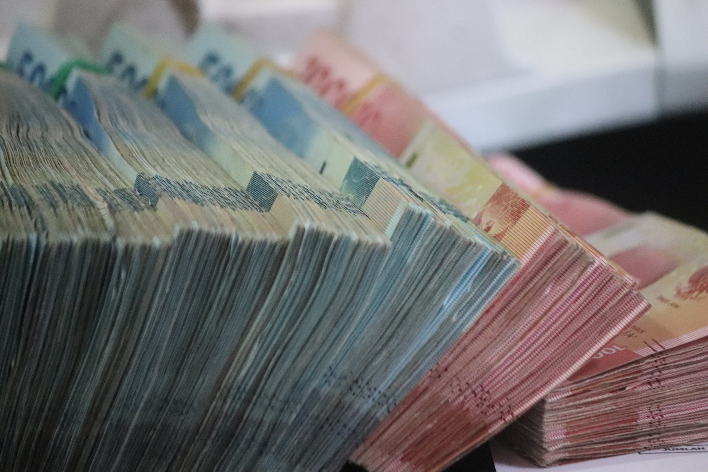

# Kin

Kreechures' in-game and reward (staking) token is named [Kin](https://kin.org/).

We chose to utilize an existing coin for our economy rather than creating yet another new coin (YANC).

Why did we do this? How does it benefit the collectors and the project?

### **TLDR summary:**

* Using an existing coin means the value of that coin is not dependent on Kreechures in any way
* Using an existing coin means the daily liquidity of that coin is not dependent on Kreechures in any way
* This provides collectors additional confidence that the value of their rewards is not dependent on the current state of the NFT ecosystem in general and Kreechures specifically
* Kreechures could die a long, or short, painful death and your coins will have the same value they had prior

So, you're saying you don't have confidence that Kreechures could successfully create a new coin?

It doesn't matter what type of project, organization, and/or business you are in. Creating a new, successful coin that has long-term value is almost an impossible task. It's immensely difficult to do and there are entire companies and huge enterprises that have attempted this, and focused solely on this, and failed.

We want to focus on our core value prop and not add another insanely difficult, and unnecessary, challenge on top of that.

### **Longer discussion:**

Creating a new cryptocurrency on most chains is a pretty simple task. For Solana, it's just a few commands in the CLI and you'll have your brand new coin, MonkeyHairCoin (MHC), with the supply you set, 100 BILLION MHC!!!!!!!!, and you'll control that entire supply.&#x20;

{Internal monologue}  Completely ignoring all of the legal and regulatory challenges that exist in creating a new cryptocurrency. These challenges are not insignificant.

Starting out, you own the entire supply. You own all of the MHC in the entire world!

What if it goes to a penny (USD) or even a dollar??!! You're set forever!

But who is going to buy your MHC from you for a penny each? Why would they value 1 MHC = $0.01 USD? Why would they give it any value at all?

So, your first step is giving away your MHC to your collectors. **STAKING!!!!** They'll be so excited. They're getting this new coin as "passive income" and next month everyone is buying their lambo.

You even create some cool new toys, **UTILITY!!!**, for people to spend their MHC on. You've got your banner generator, staking missions, wallet trackers, NFT analysis page, and even a game is coming soon!

And everyone was delighted. Your project floor is skyrocketing. And then it happens.

Someone is tired of the banner generator, they don't care about the game, they don't want yet another bracelet. They want cold hard cash. So, they jump into their favorite wallet to swap MHC for USDC or SOL.

Wait. What's going on?!

Why can't I trade my MHC for USDC, SOL, or anything?

Questions you should ask of a project that created their own coin?

* What is the coin and why can't I swap it for any other coin, like SOL or USDC?
* If you can swap it, where does the liquidity come from? Did the team use mint funds, or royalties, to create this initial liquidity? Mint funds run out and using royalties, which do slow down over time, creates a ponzi-like situation (that's the nice way of saying that).
* What about this coin ecosystem creates actual value for this new coin?

Yes, I know about [ApeCoin](https://coinmarketcap.com/currencies/apecoin-ape/), [Dust](https://coinmarketcap.com/currencies/dust-protocol/), and [SHDW](https://coinmarketcap.com/currencies/genesysgo-shadow/). Please tread carefully if you ask these critical questions and the only response you receive is "Yeah, well whudda about ApeCoin, Dust, and Shadow??!!".

### Kin

Kin has one of the most beautiful "mining operations" that exist in crypto.&#x20;

If you build something users find delightful or useful enough to participate in the economy, aka they are spending Kin on your thing, then you are rewarded for that on a weekly basis.

It's the perfect way to monetize your app, service, whatever without having to resort to the typical standards of **ADS EVERYWHERE** and/or harvesting user data and selling to the highest bidder.

Wait...I can build a cool thing and instead of the user paying for that thing in fake stars, diamonds, points they can pay me in this AND I get an extra reward for them doing so? Yes.

And the users can use their Kin to pay me, use them in other apps for other cool things, buy [giftcards](https://giftery.io/), buy merch, or even swap it for some other coin whenever they want??!! Yes.

**At its most basic level:**

* The more users that spend Kin on our "stuff" (game, raffles, other utility) the higher our KRE rewards will be
* Those KRE rewards are used to pay for operations costs (servers, paychecks for the team, services, etc.) and contribute to the rewards we provide to collectors via staking.

Our current KRE rewards are in the gutter lol To date, our sole focus has been in testing and building things that users value in the first place. As we refine those items, additional Kin spends will be implemented that will contribute to us climbing the KRE charts.

**Learn more about Kin and the KRE**

* [Kin](https://kin.org/)
* [Introducing the Kin Rewards Engine](https://medium.com/kinblog/introducing-the-kin-reward-engine-fa18067ac6db)
* [KRE](https://github.com/kinecosystem/rewards-engine)
