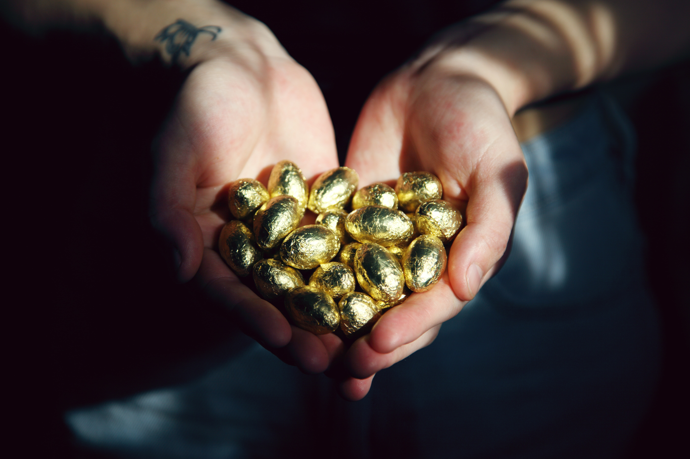

# Value creation

### TLDR

_**When researching NFT projects, please ask the simple question of, how will project x generate revenue outside of the NFT mint and royalties.**_

**Tread carefully when the answers include:**

* We're going to be a GLOBAL BRAND!!!
* Our new crypto coin is going to moon so hard!!!
* We're doing revenue share with our royalties!!!

We are targeting mainstream users and players in nearly everything we do. Our target market for our games, utility, etc. is not the crypto, or NFT, enthusiast. Our NFT collection is geared towards the NFT collector but our utility is focused on a much larger market.

Kreechures is creating value for a broader, more mainstream audience and using that value to reward collectors via staking.

In our case, Kin spends from players/users in our games, on subscriptions (like Fortnite's Battle Pass), cosmetic items, etc. will not only be revenue generating from the Kin spend itself but will also increase our weekly KRE rewards, discussed in Tokenomics/Kin.

* Of note, our goal is to not "live off of" the KRE. The KRE is a powerful monetization tool but it should be one of a project's monetization strategies and not the only one.

As much money that flows through the various NFT marketplaces, the actual number of users is pretty small. It's growing yes. It's trending in the right direction yes. But it's not an overly huge ecosystem.

So, if you're creating a game for instance, limiting that game to players with your NFT significantly restricts your growth. And please, lets be honest, who is spending hundreds or thousands of dollars on a game alone, from purchasing your NFT? The utility, and/or value, of your NFT cannot come from simply having access to a game, for example.

Collectors should inquire and demand the plan for a project's x, y, and z utility to see how that utility ends up providing some ROI to the collector. This ROI doesn't have to strictly be in the form of money/crypto although that is often what collectors are rightfully looking for.

